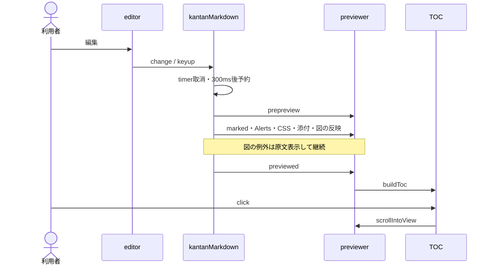
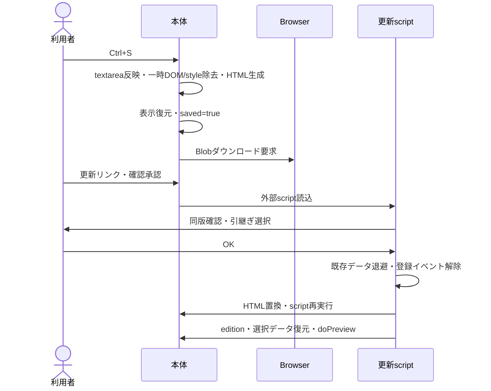

# シーケンス図

## 描画・目次

```mermaid
sequenceDiagram
 actor U as 利用者
 participant E as editor
 participant C as kantanMarkdown
 participant P as previewer
 participant T as TOC
 U->>E: 編集
 E->>C: change / keyup
 C->>C: timer取消・300ms後予約
 C->>P: prepreview
 C->>P: marked・Alerts・CSS・添付・図の反映
 Note over C,P: 図の例外は原文表示して継続
 C->>P: previewed
 P->>T: buildToc
 U->>T: click
 T->>P: scrollIntoView
```

## 保存・更新

```mermaid
sequenceDiagram
 actor U as 利用者
 participant C as 本体
 participant B as Browser
 participant X as 更新script
 U->>C: Ctrl+S
 C->>C: textarea反映・一時DOM/style除去・HTML生成
 C->>C: 表示復元・saved=true
 C->>B: Blobダウンロード要求
 U->>C: 更新リンク・確認承認
 C->>X: 外部script読込
 X->>U: 同版確認・引継ぎ選択
 U->>X: OK
 X->>X: 既存データ退避・登録イベント解除
 X->>C: HTML置換・script再実行
 X->>C: edition・選択データ復元・doPreview
```

書出しはdoPreview後の描画DOM/CSS/目次を抽出する別経路で、添付Blobを再埋込みしない。画像Edit→drawer.show→Save→layerContent/trimInfo更新→キャッシュ破棄→doPreview。HTML取込取消は通常添付へ分岐する。
