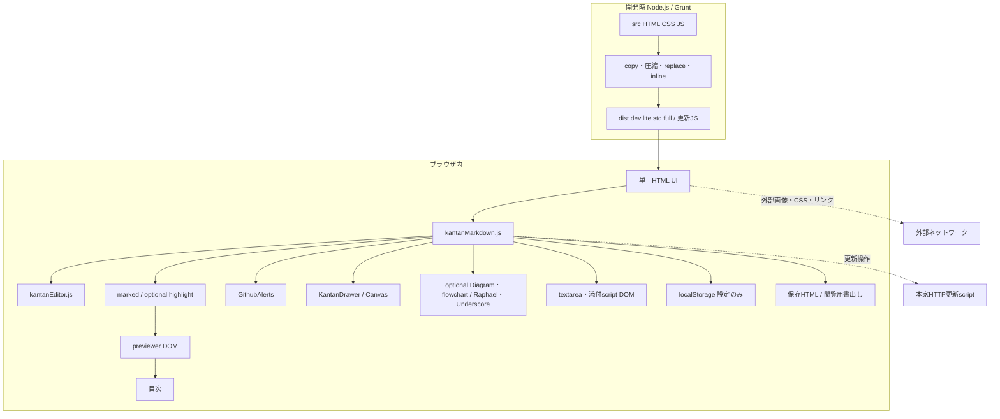

# アーキテクチャ構成図

```mermaid
flowchart TD
 subgraph Dev[開発時 Node.js / Grunt]
 SRC[src HTML CSS JS] --> GRUNT[copy・圧縮・replace・inline]
 GRUNT --> DIST[dist dev lite std full / 更新JS]
 end
 subgraph Browser[ブラウザ内]
 UI[単一HTML UI] --> CORE[kantanMarkdown.js]
 CORE --> EDIT[kantanEditor.js]
 CORE --> PARSE[marked / optional highlight]
 PARSE --> PREVIEW[previewer DOM]
 CORE --> ALERT[GithubAlerts]
 CORE --> DRAW[KantanDrawer / Canvas]
 CORE --> DIAGRAM[optional Diagram・flowchart / Raphael・Underscore]
 CORE --> DATA[textarea・添付script DOM]
 CORE --> SETTINGS[localStorage 設定のみ]
 CORE --> OUTPUT[保存HTML / 閲覧用書出し]
 PREVIEW --> TOC[目次]
 end
 DIST --> UI
 CORE -. 更新操作 .-> REMOTE[本家HTTP更新script]
 UI -. 外部画像・CSS・リンク .-> NET[外部ネットワーク]
```

サーバー・DBは不要だがサニタイズやネットワーク隔離の境界ではない。ktm-new.htmlは別管理の入口。spinoff_pj_fork/kantan-md_localは別実装でGrunt対象外。本体にはMermaid・KaTeXを導入していない。
