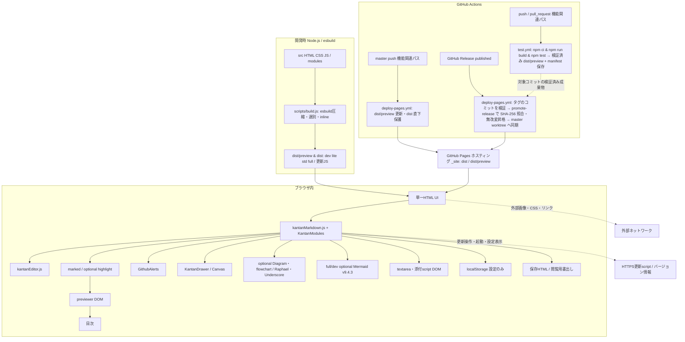

# アーキテクチャ構成図

```mermaid
flowchart TD
 subgraph Dev[開発時 Node.js / esbuild]
 SRC[src HTML CSS JS / modules] --> BUILD[scripts/build.js: esbuild圧縮・選別・inline]
 BUILD --> DIST[dist/preview & dist: dev lite std full / 更新JS]
 end
 subgraph CI_CD[GitHub Actions]
 PUSH_PR[push / pull_request 機能関連パス] --> TEST_WF[test.yml: npm ci & npm run build & npm test → 検証済み dist/preview + manifest 保存]
 MERGE_MASTER[master push 機能関連パス] --> DEPLOY_WF[deploy-pages.yml: dist/preview 更新・dist 直下保護]
 REL[GitHub Release published] --> DEPLOY_WF_REL[deploy-pages.yml: タグのコミットを検証 → promote-release で SHA-256 照合・無改変昇格 → master worktree へ同期]
 TEST_WF -. 対象コミットの検証済み成果物 .-> DEPLOY_WF_REL
 end
 subgraph Browser[ブラウザ内]
 UI[単一HTML UI] --> CORE[kantanMarkdown.js + KantanModules]
 CORE --> EDIT[kantanEditor.js]
 CORE --> PARSE[marked / optional highlight]
 PARSE --> PREVIEW[previewer DOM]
 CORE --> ALERT[GithubAlerts]
 CORE --> DRAW[KantanDrawer / Canvas]
 CORE --> DIAGRAM[optional Diagram・flowchart / Raphael・Underscore]
 CORE --> MERMAID[full/dev optional Mermaid v9.4.3]
 CORE --> DATA[textarea・添付script DOM]
 CORE --> SETTINGS[localStorage 設定のみ]
 CORE --> OUTPUT[保存HTML / 閲覧用書出し]
 PREVIEW --> TOC[目次]
 end
 DIST --> UI
 DEPLOY_WF --> PAGES[GitHub Pages ホスティング _site: dist / dist/preview]
 DEPLOY_WF_REL --> PAGES
 PAGES --> UI
 CORE -. 更新操作・起動・設定表示 .-> REMOTE[HTTPS更新script / バージョン情報]
 UI -. 外部画像・CSS・リンク .-> NET[外部ネットワーク]
```

サーバー・DBは不要だがサニタイズやネットワーク隔離の境界ではない。ktm-new.htmlは別管理の入口。spinoff_pj_fork/kantan-md_localは別実装でビルド対象外。Mermaidはfull/devに内包する。KaTeXは内包しない。
